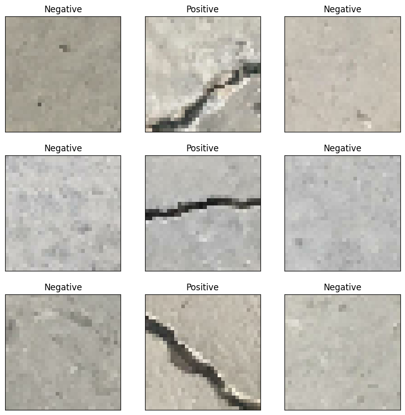
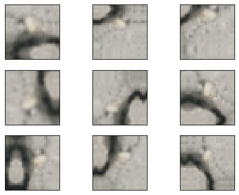
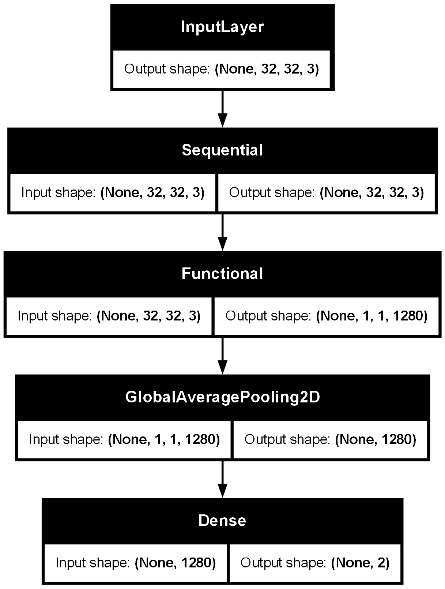
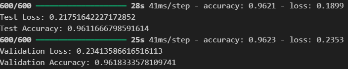
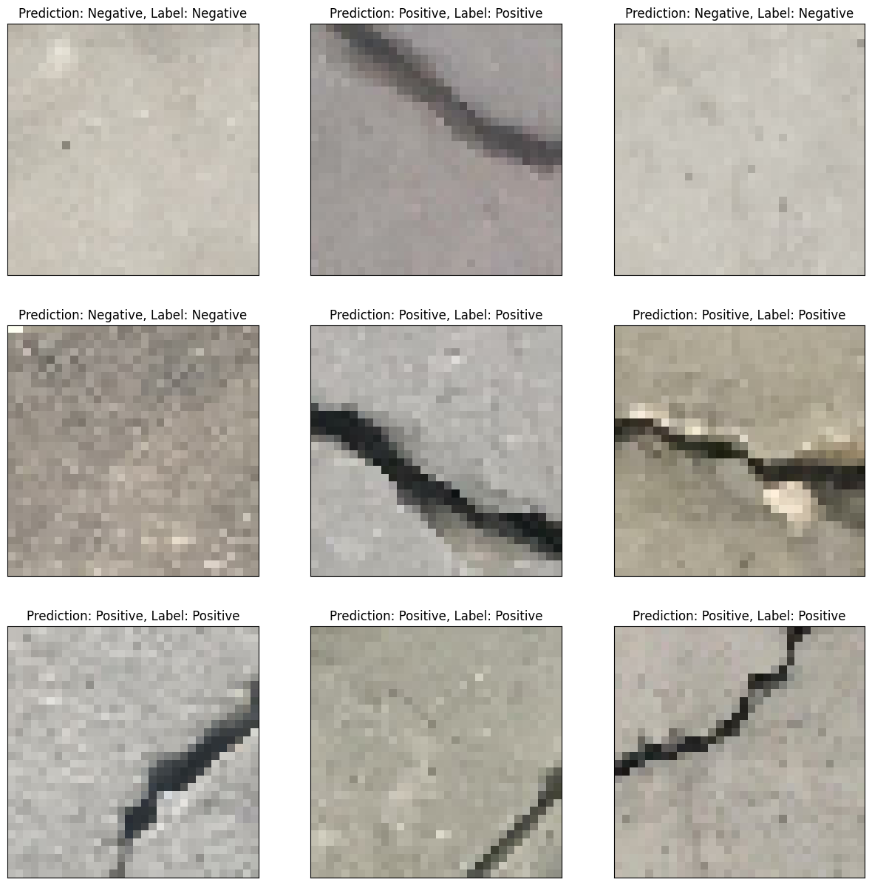

# Concrete Crack Classification

This project aims to automate the detection of cracks in concrete structures using deep learning techniques. Specifically, it utilizes a **Convolutional Neural Network (CNN)** model, leveraging **transfer learning** with the EfficientNetV2-B0 architecture. The goal is to classify images of concrete surfaces into two categories: **Positive** and **Negative**.

# Instruction
1. Download the dataset from this [link](https://data.mendeley.com/datasets/5y9wdsg2zt/2)
2. Make a folder called "datasets" into the repository if there's none
3. Unzip the content of the zip file into the datasets folder.
4. Run the python script (concrete_crack_classification.py) file.

## Problem Statement

The task is to classify images of concrete surfaces into two categories:
- **Positive**: Images where cracks are visible in the concrete surface.
- **Negative**: Images with a healthy, crack-free concrete surface.

**Concrete Crack Label**

## Data Preprocessing

1. **Resizing**: All images are resized to a fixed size (e.g., 64x64 pixels) to ensure consistency and compatibility with the input requirements of the model.
2. **Normalization**: Pixel values are normalized (scaled between 0 and 1) to improve the convergence speed during training.
3. **Data Augmentation**: To improve generalization and prevent overfitting, the dataset is augmented using transformations such as rotations, flips, and zooms. This allows the model to see more variations of the concrete surfaces.

**Data Augmentation Sample**

## Model Selection
We use the EfficientNetV2-B0 model, a fast and accurate CNN that is pre-trained on ImageNet and can be fine-tuned for our crack classification task.

Why EfficientNetV2-B0?
Efficiency: EfficientNetV2 is resource-efficient, delivering high accuracy with less computational cost.
Transfer Learning: Pre-trained on ImageNet, it already knows basic image features, making it easier to adapt to our crack detection task with fewer training samples.
## Transfer Learning
Transfer learning allows us to use a pre-trained model and adjust it for a new task. Here's how we adapt EfficientNetV2-B0:

Freeze the Base Model: We freeze the pre-trained layers so they don't change initially, preserving the knowledge gained from ImageNet.
Add Custom Layers: We add layers like Global Average Pooling and a Dense output layer for binary classification.
Fine-tuning: After training the new layers, we unfreeze the base layers and fine-tune the whole model to better detect cracks.
## Model Training
Training involves the following steps:

Compilation: The model is compiled with an optimizer (e.g., Adam), loss function (e.g., binary cross-entropy), and evaluation metric (e.g., accuracy).
Batch Size & Epochs: The model is trained using a batch size (e.g., 32) and a set number of epochs (e.g., 5), depending on the dataset and hardware.
Validation: The model is validated on a separate set of images during training to check for overfitting and adjust hyperparameters.#

## Model Architecture

## Evaluation

## Result

### Datasets
The project uses publicly available datasets. You can download it from [Mendeley Data](https://data.mendeley.com/datasets/5y9wdsg2zt/2).